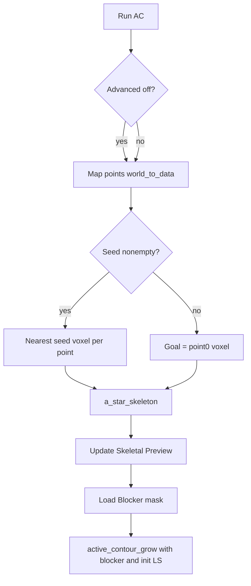

# Skeleton A*, Blockers, and Result Persistence

## Scope and assumptions

- **Modes apply to the Active Contour path only**: add a checkbox on the **3D Active Contour** tab (default off = Legacy). Plain region growing stays as today except where **coordinate mapping** should be unified (see below).
- **Length mask for AC** (existing [`_length_mask`](src/regiongrow/_active_contour.py)) continues to use **first and last** point in the Points layer as endpoints until you specify otherwise; skeleton paths use **all** points.
- **Performance**: full-volume 26-connected A* from each point can be O(volume) per path. The plan includes an optional **tight bounding box** around all seed voxels, all mapped point voxels, and a margin (e.g. 32 voxels) to keep runs interactive on large volumes (implementation detail, not a separate mode).

## Coordinate stability (widget + callers)

- Add a small helper in [`src/regiongrow/_widget.py`](src/regiongrow/_widget.py), e.g. `_points_world_to_image_zyx(image_layer, points_layer)`, that:
  - Reads `points_layer.data` in **world** coordinates (napari’s default for Points).
  - For each row, calls `image_layer.world_to_data(np.asarray(pt, dtype=float))` (batch API can be finicky; row-wise is robust in napari-dev).
  - Rounds with `np.floor` or `np.rint` to integer indices, then **clips** to `[0, shape[d]-1]` for each axis so downsampling / transforms cannot produce out-of-range indices.
- Use this helper anywhere segmentation reads points: **plain** `_run_plain` and **AC** `_run_ac` (not raw `np.asarray(points_layer.data)`).
- **Advanced + empty seed**: relax the current guard in [`_run()`](src/regiongrow/_widget.py) that requires `seed_mask.any()` **only when** the AC tab is active **and** Advanced Skeleton is checked; otherwise keep the existing seed requirement for Plain and Legacy AC.

## Phase 1 – Data structures and layers ([`src/regiongrow/_widget.py`](src/regiongrow/_widget.py))

- **Checkbox**: `QCheckBox("Advanced Skeleton Mode")` on the AC tab (default unchecked). Tooltip describing Legacy vs Advanced.
- **Blocker layer**: Before starting an AC run (or on plugin init / “Ensure Blocker” button—minimal approach: on **Run** when AC tab active), if no layer named `"Blocker"`, `add_labels` zeros with the same shape as the image and **`spatial_alignment_kwargs(image_layer)`** (already includes `units` / transform in [`src/regiongrow/_spatial.py`](src/regiongrow/_spatial.py)).
- **Skeletal Preview**: ephemeral labels layer `"Skeletal Preview"` (green colormap / `color` / napari labels color API as appropriate), same shape and spatial kwargs; remove or clear when starting a new AC run or when switching back to Legacy.
- **Persistence**: increment `self._result_version` (init 0). When (re)creating the live result layer before a run: if a layer named `"Segmentation Result"` exists, rename it to `Result_v{self._result_version}`, set `opacity=0.3`, `editable=False`, then bump the counter. Then add a fresh `"Segmentation Result"` as today (opacity 0.5, editable True). Adjust `_reset` / postprocess if they assume a fixed name (only touch `"Segmentation Result"` for clear, not archived `Result_v*`).

## Phase 2 – A* skeleton ([`src/regiongrow/_algorithm.py`](src/regiongrow/_algorithm.py))

- Add **`a_star_skeleton`** (or similarly named) that takes at minimum:
  - `image` (Z,Y,X float), `spacing` (3-vector, same as rest of plugin), `seed_mask` (bool), `start_indices` (N×3 int list of voxel starts from mapped points), `epsilon` small positive constant.
- **Goals**:
  - If `seed_mask.any()`: for each start, target = **nearest seed voxel** by physical L2 distance between voxel centres (`|| (i-j) * spacing ||`).
  - Else: target = **rounded/clipped voxel of point index 0**; every other start connects to that voxel.
- **Graph**: 26-neighbour offsets; edge weight from voxel `u` to neighbour `v`:
  - `dist = np.linalg.norm((v-u) * spacing)` (physical L2).
  - `cost = (float(image[v]) + epsilon) * dist` (lumen = darker = lower cost).
- **Algorithm**: A* with priority queue; admissible heuristic, e.g. `h(v) = epsilon * dist_phys(v, goal)` (valid when image intensities are ≥ 0 after float conversion). If image can be negative after preprocessing, clamp intensity term for the heuristic or fall back to Dijkstra (`h=0`).
- **Output**: boolean (or uint8) mask, union of all reconstructed paths.
- **No world geometry here**: all indices in **image voxel space**; spacing only for edge lengths.

## Phase 3 – MGAC + blocker ([`src/regiongrow/_active_contour.py`](src/regiongrow/_active_contour.py))

- **`blocker_mask`**: optional `bool` same shape as `image`. Thread/worker receives a numpy copy.
- **Speed map**: after `_inverse_gaussian_gradient_physical(...)`, work on a **copy** `gimage_eff = gimage.copy(); gimage_eff[blocker_mask] = 0.0` and pass `gimage_eff` into the MGAC loop.
- **Hard barrier**: extend [`_morphological_geodesic_active_contour_aniso`](src/regiongrow/_active_contour.py) to accept `blocker_mask`; at the **end of each** inner iteration (after balloon, attachment, smoothing), set `u[blocker_mask] = 0` (int8 safe).
- **`active_contour_grow` signature**: add optional `blocker_mask=None`, `init_level_set=None` (or `skeleton_mask` + internal dilation):
  - **Legacy**: current `ls = _init_tube(...) & lmask`.
  - **Advanced**: `ls = binary_dilation(skeleton_mask, iterations=2, structure=generate_binary_structure(3,1)) & lmask` (2 voxel layers via two 6-connected dilations—interpretation per your spec; adjust to one `binary_dilation` with a radius-2 ball if you prefer isotropic voxel radius).
- **Yield contract**: today `_on_step` expects `(iteration, mask)`. Extend to support a **preview** frame, e.g. yield `(-1, skeleton_mask)` for skeleton only, then non-negative iterations for MGAC (widget branches on `iteration < 0` to update `"Skeletal Preview"` vs `"Segmentation Result"`).

## Phase 4 – Wire AC advanced flow ([`src/regiongrow/_widget.py`](src/regiongrow/_widget.py))

- **Worker sequence** (single `thread_worker`):
  1. Run `a_star_skeleton` → yield `(-1, union_mask)` for UI.
  2. Build `init_ls` from dilated skeleton; call `active_contour_grow(..., init_level_set=init_ls, blocker_mask=..., start_point=points[0], end_point=points[-1], ...)` (unchanged length mask unless you later change policy).
- **Legacy path**: skip A* and preview; `blocker_mask` still applied if present; `init_level_set` omitted so internal `_init_tube` runs as today.
- **Blocker data**: `blocker_mask = viewer.layers['Blocker'].data > 0` aligned with `image_data.shape` (same layer shape as selected image).

## Files to touch (summary)

| File | Changes |
|------|--------|
| [`src/regiongrow/_widget.py`](src/regiongrow/_widget.py) | Checkbox; world_to_data mapping; seed validation branch; Blocker + Skeletal Preview + persistence; AC worker two-phase yields; pass `blocker_mask` / `init_level_set` / flags |
| [`src/regiongrow/_algorithm.py`](src/regiongrow/_algorithm.py) | `a_star_skeleton` (26-conn, cost model, optional bbox) |
| [`src/regiongrow/_active_contour.py`](src/regiongrow/_active_contour.py) | `blocker_mask` on gimage + hard clamp in MGAC loop; optional custom `init_level_set`; document new args |

## Testing (manual / smoke)

- Downsampled image + points placed in napari: confirm indices match brush after `world_to_data`.
- Advanced: multiple points + seed brush → green preview path; MGAC fills from dilated skeleton.
- Empty seed + Advanced: paths star to point 0.
- Blocker painted crossing lumen: contour must not cross blocker voxels after evolution.
- Second Run: prior `"Segmentation Result"` becomes `Result_v0` at 0.3 opacity, non-editable; new result layer active.
